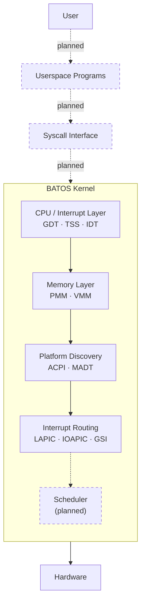
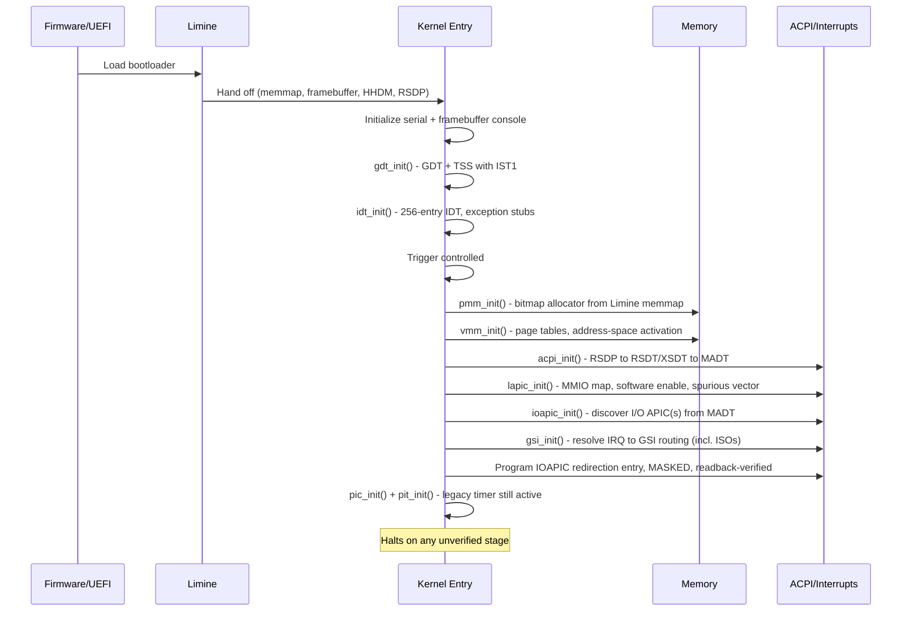
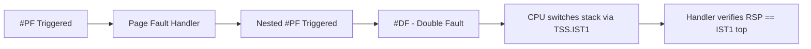
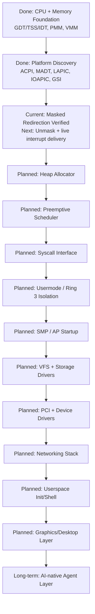

# BATOS Kernel

A 64-bit, freestanding operating system kernel for the x86_64 architecture, built independently from scratch — no forked kernel source, no inherited codebase.

---

## Status

**Pre-alpha. Bare-metal bring-up stage.** The kernel currently boots, sets up its core CPU/memory infrastructure, discovers and initializes interrupt hardware, and halts in a controlled, verified state. There is no scheduler, no userspace, and no filesystem yet — this is explicitly documented below under [Roadmap](#roadmap).

| Aspect | State |
|---|---|
| Boots on real interrupt hardware (LAPIC/IOAPIC) | Yes |
| Runs user programs | No |
| Has a filesystem | No |
| Has networking | No |
| Production-ready | No |

---

## Design Philosophy

- **Verify before trusting.** Every hardware bring-up stage (LAPIC, IOAPIC, ACPI tables, page tables) is read back and checked immediately after being programmed. If a stage cannot be verified, the kernel halts (`cli; hlt`) rather than continuing on an unconfirmed state.
- **No inherited kernel code.** The kernel does not fork or derive from Linux, BSD, or any existing kernel. The only third-party component is the [Limine](https://github.com/limine-bootloader/limine) bootloader, used for boot handoff — a standard, common practice for from-scratch kernels, not a kernel dependency.
- **Interrupts and memory before anything else.** Every higher-level subsystem (scheduling, drivers, syscalls) depends on interrupt routing and memory management being correct first. These are treated as prerequisites, not incidental setup.
- **Explicit failure over silent failure.** There is no code path that assumes success without checking. Failed verification halts the CPU with a diagnostic message over serial output.

---

## Architecture Overview



Dashed elements are planned and not yet implemented.

---

## Boot Flow



---

## Repository Structure

```
batos-os/
├── boot/                    # Boot-stage assets
├── iso_root/                # ISO staging directory (build output)
├── limine/                  # Limine bootloader binaries/protocol headers
├── kernel/
│   ├── kernel.c              # Kernel entry point, bring-up sequencing
│   └── arch/x86_64/
│       ├── gdt.c / gdt.h      # Global Descriptor Table + TSS descriptor
│       ├── tss.c / tss.h      # Task State Segment, IST1 stack
│       ├── idt.c / idt.h      # Interrupt Descriptor Table
│       ├── pmm.c / pmm.h      # Physical Memory Manager (bitmap)
│       ├── vmm.c / vmm.h      # Virtual Memory Manager (page tables)
│       ├── pic.c / pic.h      # Legacy 8259 PIC
│       ├── irq.c / irq.h      # IRQ dispatch table
│       ├── pit.c / pit.h      # Programmable Interval Timer
│       ├── lapic.c / lapic.h  # Local APIC bring-up
│       ├── ioapic.c / ioapic.h# I/O APIC discovery + redirection
│       ├── gsi.c / gsi.h      # ACPI GSI routing resolution
│       ├── acpi.c / acpi.h    # RSDP/RSDT/XSDT/MADT parsing
│       └── interrupts.asm     # Exception/IRQ entry stubs (NASM)
├── linker.ld                 # Higher-half kernel linker script
├── limine.conf                # Bootloader boot entry configuration
├── limine.h                   # Limine boot protocol header
└── Makefile                   # Build + ISO generation
```

---

## CPU / Interrupt Foundation

- **GDT**: Null, kernel code, kernel data, and a 64-bit TSS descriptor (occupying two GDT slots, as required for long mode).
- **TSS**: A dedicated `IST1` stack is configured, used exclusively for the Double Fault handler so that a fault occurring on a corrupted or exhausted kernel stack still has a valid stack to run on.
- **IDT**: All 256 vectors are populated with exception stubs (`interrupts.asm`). Vector 8 (`#DF`) is explicitly routed through IST1 in the gate descriptor; all others use the current stack.
- **Verified via induced faults**: the kernel deliberately triggers a page fault, then a *nested* page fault from inside the first handler, to confirm the Double Fault path and IST1 switch actually engage — not just that the code compiles.



---

## Memory Management

### Physical Memory Manager (PMM)

- Bitmap-based frame allocator built from the Limine memory map response.
- Placed at a physical address chosen after scanning `LIMINE_MEMMAP_USABLE` regions; usable/reserved/reclaimable regions are handled distinctly.
- Uses the Limine HHDM (Higher Half Direct Map) offset to access physical memory from kernel virtual space.

### Virtual Memory Manager (VMM)

- Builds and owns its own page-table hierarchy (PML4 → PDPT → PD → PT) rather than reusing the bootloader's tables.
- Implements recursive page-table cloning and a dedicated "address-space activation" step (loading a new `CR3` and confirming translation still resolves correctly afterward).
- Includes explicit inspection routines that walk the live page tables and cross-check a virtual address's hardware translation against the VMM's own bookkeeping, used as a correctness check rather than assumed.


---

## Platform Discovery: ACPI

- **RSDP**: obtained via the Limine RSDP request; both ACPI v1 and v2 (XSDT-capable) structures are handled.
- **RSDT/XSDT**: root table is selected based on ACPI revision (XSDT preferred when available), with checksum validation on the discovered tables before they are trusted.
- **MADT**: parsed for Local APIC entries, I/O APIC entries, and Interrupt Source Override (ISO) entries — the latter is what allows legacy ISA IRQs to be correctly remapped to non-identity GSIs when the platform requires it.

---

## Interrupt Routing: LAPIC, IOAPIC, GSI

- **LAPIC**: MMIO base mapped through the VMM/HHDM, software-enabled via the Spurious Interrupt Vector Register, with an explicit check that the enable bit actually latched before proceeding. A dummy EOI is issued to confirm the MMIO path is writable.
- **IOAPIC**: discovered from MADT entries; physical/virtual MMIO addresses, IOAPIC ID, version, and maximum redirection entry count are all read back and logged, not assumed from spec defaults.
- **GSI routing**: resolves legacy IRQ numbers to their correct Global System Interrupt, accounting for ACPI Interrupt Source Overrides (polarity and trigger mode), rather than assuming an identity IRQ-to-GSI mapping.
- **Masked redirection programming**: a redirection entry is written with the mask bit explicitly set, high dword first and low dword (containing the mask bit) last — the ordering that avoids a window where the entry could unintentionally deliver an interrupt mid-write. The write is followed by a readback that confirms both the written value and that the mask bit is still set.


The legacy PIC and PIT remain active and untouched during this bring-up — they are not disabled until the IOAPIC path is fully verified, to avoid losing timer interrupts mid-transition.

---

## Currently Verified Functionality

The following have been exercised and confirmed via serial-log inspection in QEMU, not just compiled:

- Higher-half kernel load and ELF/linker layout via `linker.ld`
- GDT/TSS installation and selector reload
- 256-entry IDT installation
- Deliberate Page Fault → nested Page Fault → Double Fault → IST1 stack switch chain
- PMM initialization and frame accounting from the Limine memory map
- VMM page-table construction, CR3 switch, and post-switch translation verification
- ACPI RSDP → root table → MADT discovery, with checksum validation
- LAPIC software enable and spurious-vector handling
- IOAPIC MMIO discovery and register read/write path
- GSI resolution including ISO-based remapping
- Masked IOAPIC redirection entry write + readback verification
- PIC remap to vectors 32-47 and PIT channel 0 configuration (legacy timer path, coexisting with the APIC path during bring-up)

Not yet exercised: actual unmasked interrupt delivery through the IOAPIC/LAPIC path (this is the immediate next step — see Roadmap).

---

## Build Instructions

Requirements: `gcc`, `ld`, `nasm`, `xorriso`.

```bash
make
```

This compiles the C sources (`-ffreestanding`, `-mcmodel=kernel`, `-mno-red-zone`, no SSE/FPU) and the NASM interrupt stubs, links them via `linker.ld`, and produces `build/batos.elf`. The `iso` target stages the ELF and Limine bootloader files into `iso_root/` and produces a hybrid BIOS/UEFI-bootable ISO via `xorriso`, with `limine bios-install` applied for legacy boot.

```bash
make clean
```

Removes build artifacts.

---

## Running / Testing

```bash
qemu-system-x86_64 -cdrom build/batos.iso -serial stdio
```

`-serial stdio` is required — the kernel's primary diagnostic output is over the serial port; the framebuffer console mirrors it but serial is the authoritative log during bring-up.

There is currently no automated test harness or CI pipeline. Verification is done by inspecting serial output for the expected `VERIFIED` / `OK` markers at each bring-up stage, and confirming the kernel halts cleanly (rather than triple-faulting) if a stage fails.

---

## Roadmap



### Near-term
- Unmasked IOAPIC interrupt delivery, starting with the timer IRQ, confirming end-to-end delivery through LAPIC → IDT → dispatcher → EOI.
- Kernel heap allocator, required before any dynamic subsystem (scheduler, drivers) can be built.
- Clean PIC-to-IOAPIC cutover once the APIC path is confirmed reliable under real interrupt load.

### Medium-term
- SMP: parsing remaining MADT Local APIC entries for other cores, AP startup via INIT-SIPI-SIPI, per-core LAPIC timer calibration.
- Preemptive scheduler using the LAPIC timer for time-slicing.
- Syscall entry/exit path (`syscall`/`sysret`) and a minimal syscall table.
- Ring 3 execution: per-process page tables, kernel/user memory separation, ELF loading for userspace binaries.

### Longer-term
- Virtual filesystem layer and at least one concrete filesystem/storage driver (starting with a block device driver, e.g. AHCI/NVMe).
- PCI enumeration and a small driver framework.
- Basic networking stack.
- A minimal userspace: init process, shell, core services.
- A graphics/compositor layer beyond the current raw framebuffer console.

---

## Planned: Security Architecture

Security is currently **out of scope for the code that exists** — there is no process isolation because there are no processes yet. The intended direction, once ring 3 execution exists, is capability-based: kernel resources are exposed to userspace only through an explicit permission set rather than ambient authority, and the syscall boundary is the single point where those permissions are checked. This is a design intention for upcoming work, not a claim about current guarantees.

---

## Long-Term Direction: AI-Native Agent Layer

A stated long-term goal for BATOS is to treat AI agents as a distinct execution class, architecturally separate from ordinary processes — constrained by explicit, auditable permissions at the kernel/syscall boundary rather than running with the same ambient access as a normal program.


This depends entirely on the syscall interface, usermode isolation, and capability system above existing first, none of which is implemented yet. It is documented here as a design goal that shapes upcoming architectural decisions (e.g. why the security model is being planned as capability-based rather than ambient-authority), not as a current or near-term feature.

---

## Development Notes

The project is developed with heavy use of AI-assisted code generation, combined with manual debugging, hardware verification in QEMU, and serial-log inspection at every bring-up stage. Every subsystem listed as "verified" above was confirmed by running the kernel and inspecting its actual runtime output, not by inspection of source code alone.

Contributions are not yet being solicited while the core architecture is still being established solo; this will change once the foundation (through usermode isolation) is stable.

---

## License

No license file is currently present in this repository. All rights reserved by default until a license is added.
