# BATOS Kernel

BATOS Kernel is an independently developed x86_64 operating system kernel, built from scratch as the architectural foundation for a complete, modern operating system. It is not derived from Linux, BSD, or any other existing kernel — every subsystem is designed and implemented as part of its own architecture.

---

## Vision

BATOS is intended to grow into a complete, modern operating system: fast, reliable, secure, and built on an architecture that is understandable and auditable from the hardware layer upward.

The kernel is the foundation for a full system stack — process and memory management, drivers, storage, networking, security, a userspace runtime, a graphics layer, and application support — all designed around a coherent set of architectural principles rather than assembled from borrowed components.

A distinguishing long-term goal of the project is **AI-native system design**: treating autonomous agents as a first-class, explicitly governed part of the operating system, rather than bolting AI access onto an architecture that wasn't designed for it.

---

## Core Principles

- **From-scratch architecture** — no forked kernel, no inherited subsystem code.
- **Correctness before complexity** — each layer is expected to be correct before the next is built on top of it.
- **Explicit verification** — hardware and software state is checked, not assumed.
- **Security by design** — isolation and least-privilege are architectural properties, not features added later.
- **Hardware-aware engineering** — subsystems are built with a clear understanding of the underlying x86_64 platform, not abstracted away prematurely.
- **Clear kernel/userspace boundaries** — a well-defined syscall interface separates trusted and untrusted code.
- **Modular subsystems** — memory, interrupts, scheduling, drivers, and storage are designed as distinct, replaceable components.
- **Resource efficiency** — the kernel is designed to be lightweight, avoiding unnecessary overhead.
- **Auditable behavior** — system and (eventually) agent actions are designed to be traceable.

---

## System Architecture

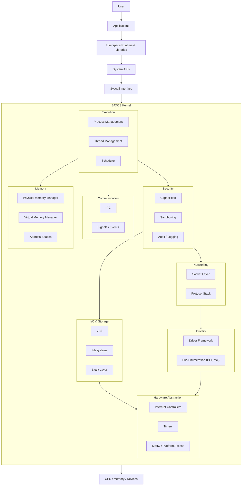

---

## Kernel Architecture

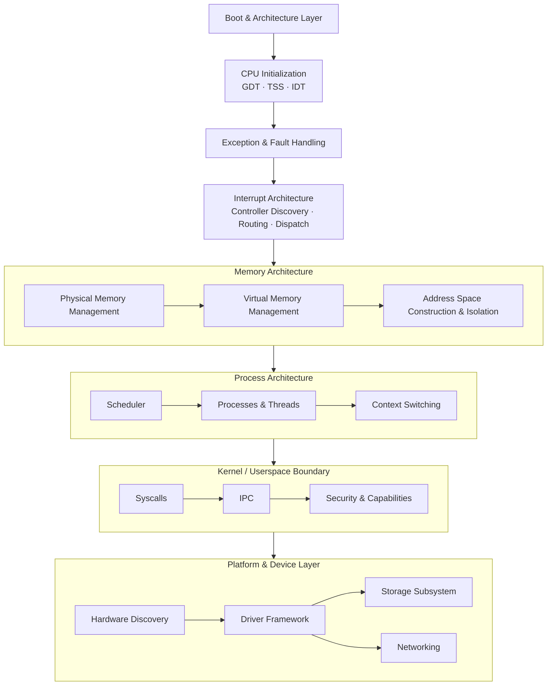

These represent the architecture BATOS is designed around. Not all subsystems are implemented at any given point — the kernel is developed incrementally, subsystem by subsystem, with each layer expected to be correct before the next is built on it.

---

## Hardware & Platform Layer

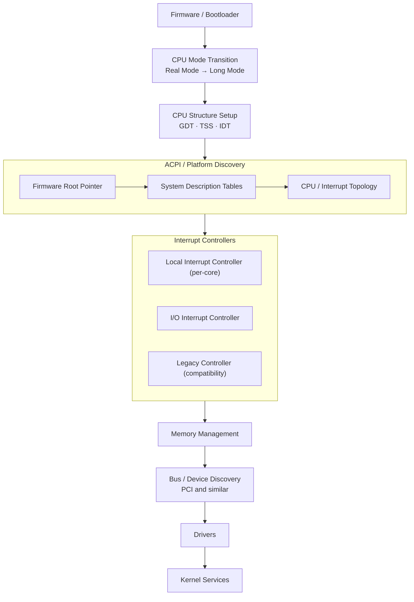

BATOS boots via a standard boot protocol handoff and brings the CPU into 64-bit long mode before initializing its own memory and interrupt infrastructure. Platform discovery is used to identify interrupt controllers, CPU topology, and devices, rather than relying on hardcoded assumptions about the underlying hardware.

---

## Memory Architecture

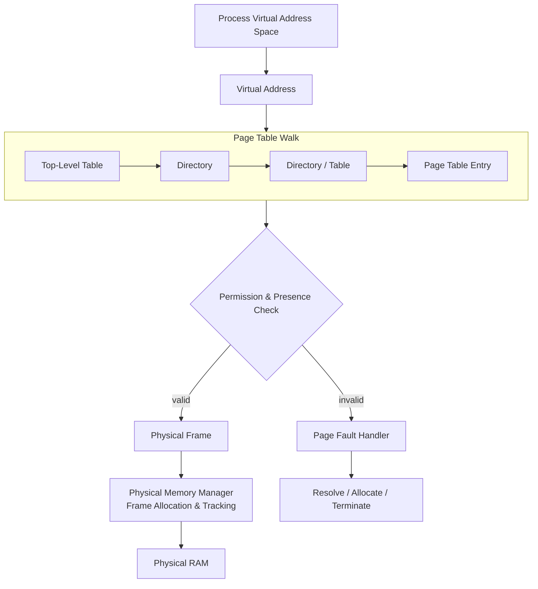

Memory management is split into two cooperating layers:

- **Physical Memory Manager (PMM)** — tracks and allocates physical memory frames, based on the memory map provided at boot.
- **Virtual Memory Manager (VMM)** — constructs and manages page tables, builds address spaces, and enforces memory isolation between the kernel and (eventually) individual processes.

Address spaces, mapping permissions, and memory protection are treated as core correctness properties of the kernel — an incorrect mapping is expected to be caught, not silently tolerated.

---

## Interrupt Architecture

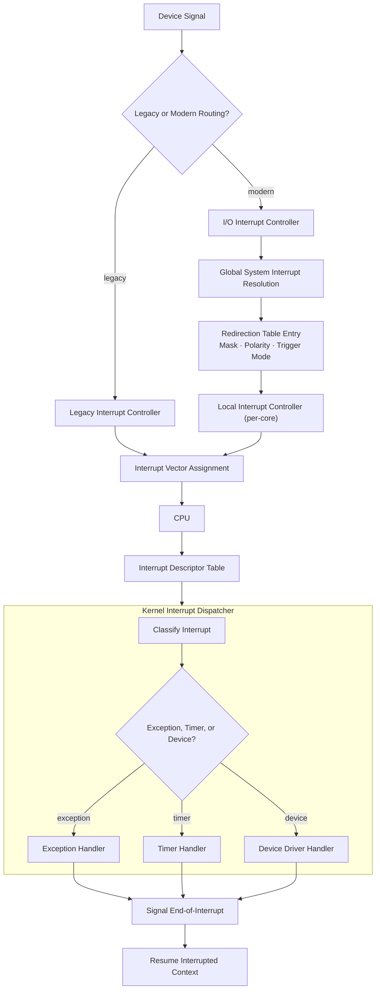

Interrupt handling is treated as a foundational kernel subsystem rather than an incidental one: nearly every higher-level feature (scheduling, drivers, timers, I/O) depends on interrupts being routed and dispatched correctly. BATOS's interrupt architecture is designed around modern APIC-based routing, with legacy controller support retained for compatibility during platform bring-up.

---

## Userspace Architecture

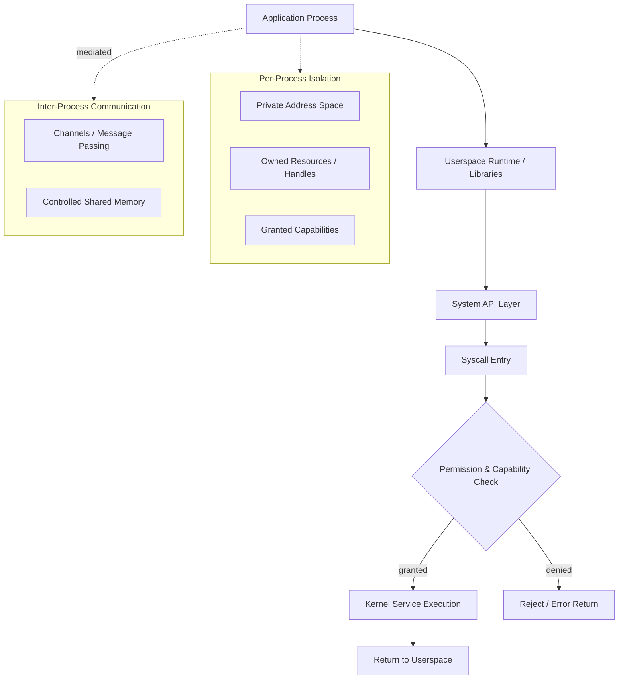

The long-term architecture enforces a strict separation between userspace and the kernel:

- Each process owns an isolated address space and an explicit set of granted capabilities.
- All kernel access happens through the syscall interface — no ambient kernel access from userspace.
- IPC is mediated rather than direct, preserving isolation between processes.

---

## Storage Architecture

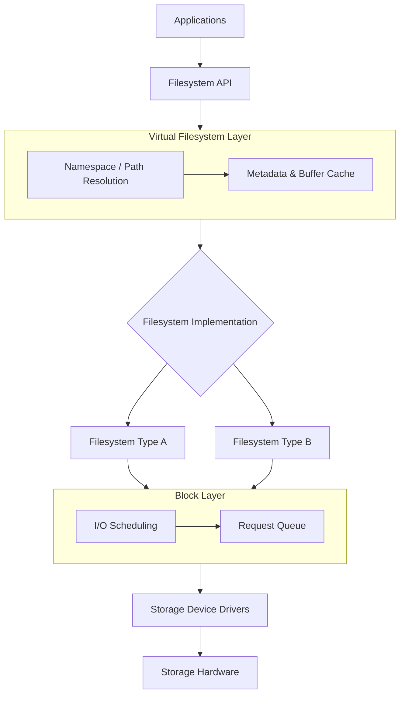

Storage is designed around a virtual filesystem (VFS) layer that abstracts over concrete filesystem implementations, sitting above a block layer that abstracts over physical storage drivers. This allows filesystem and driver implementations to evolve independently of the applications using them.

---

## Networking Architecture

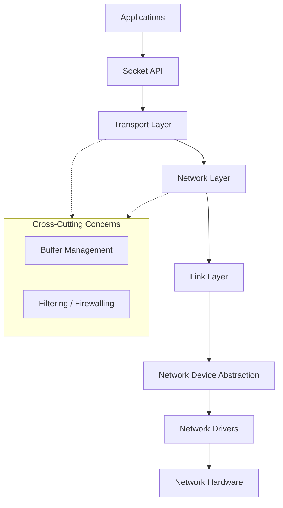

Networking is architected as a layered stack: applications interact with a socket-style API, backed by transport and network layers, which communicate with hardware through a device abstraction and concrete drivers — keeping protocol logic independent of specific hardware.

---

## Security Architecture

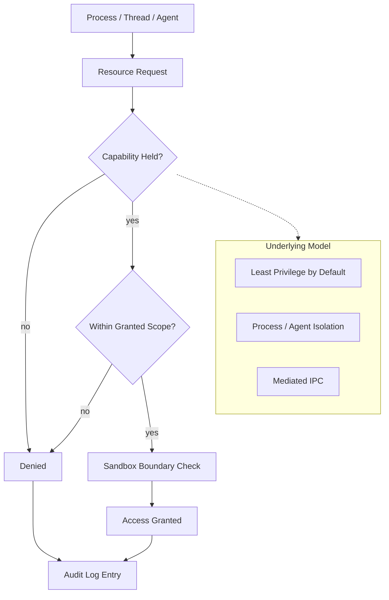

Security is treated as a first-class architectural concern, not a layer added after functionality exists. The intended model is built around strict kernel/user separation, capability-based access rather than ambient authority, least-privilege defaults, process isolation, sandboxing for untrusted contexts, mediated IPC, and auditable operations for anything crossing the kernel boundary.

These are architectural goals guiding design decisions throughout the kernel; they are not claims that every guarantee is fully enforced at every stage of development.

---

## Graphics & Desktop

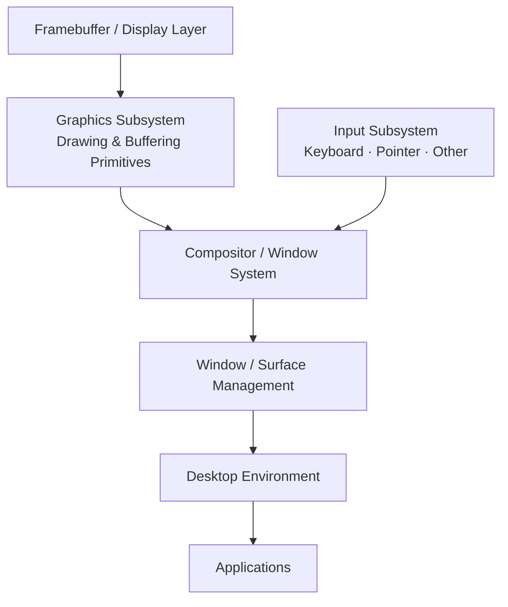

This is architectural direction rather than a description of current capability — the graphics stack is intended to be built incrementally once core kernel services are stable.

---

## AI-Native / Agentic OS

A defining part of the BATOS vision is integrating AI agents as **controlled, governed system-level actors** — not by giving an AI model unrestricted root or kernel access, but by routing agent actions through the same permission and capability infrastructure that governs any other system component.

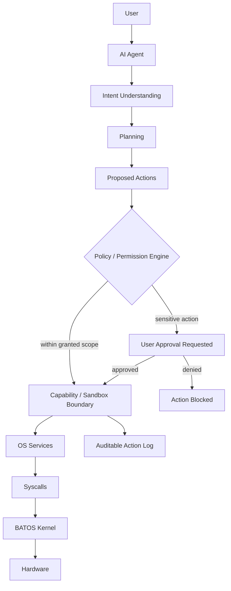

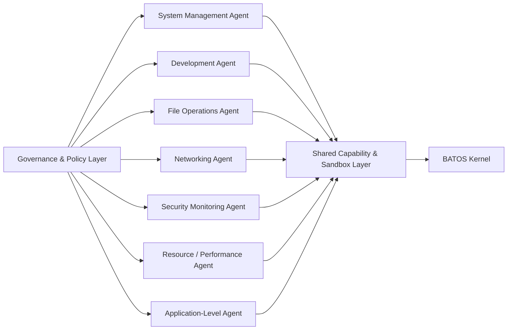

Key properties this architecture is designed around: explicit, scoped permissions per agent and per action; sandboxing that limits an agent's reach to what it has been granted; capability-based access consistent with the kernel's general security model; auditable agent actions; user approval for sensitive or irreversible operations; and kernel protection against unrestricted or implicit AI access — an agent is a governed client of the OS, not a privileged extension of it.

This is a long-term architectural direction that depends on the underlying process isolation, syscall, and capability infrastructure existing first.

---

## Development Roadmap

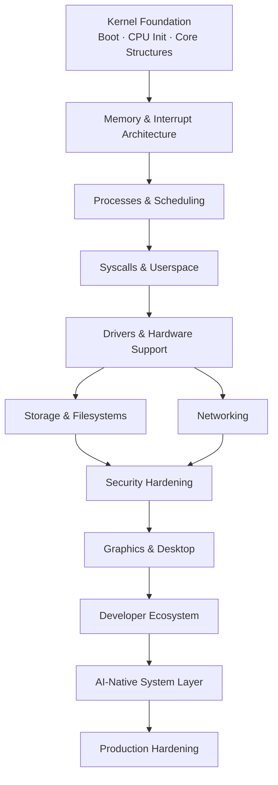

This roadmap reflects the overall direction of the project rather than a fixed schedule. Each stage builds on the correctness of the ones before it.

---

## Repository Structure

```
batos-os/
├── boot/            # Boot-stage assets
├── kernel/          # Kernel source
│   └── arch/x86_64/ # Architecture-specific subsystems (CPU, memory, interrupts, platform discovery)
├── limine/          # Bootloader integration
├── linker.ld        # Kernel linker script
├── limine.conf       # Boot configuration
└── Makefile          # Build system
```

Directory contents will grow as subsystems are added; this structure reflects the architectural layout rather than an exhaustive file listing.

---

## Building

```bash
make
```

Produces a bootable kernel image and ISO using the project's Makefile and linker script.

---

## Running

```bash
qemu-system-x86_64 -cdrom build/batos.iso -serial stdio
```

---

## Engineering Philosophy

BATOS is developed under a consistent cycle: **build → inspect → verify → test → document.**

Each subsystem is implemented, then inspected against its expected hardware/software state, verified through direct testing rather than assumption, and only then built upon. Large, unverified rewrites are avoided in favor of incremental, checkable progress — correctness at each layer is treated as a prerequisite for the next.

---

## Project Status

BATOS is an actively developed, early-stage operating system project. Core kernel subsystems are being implemented incrementally, following the architecture described above.

---

## License

No license is currently specified for this repository.